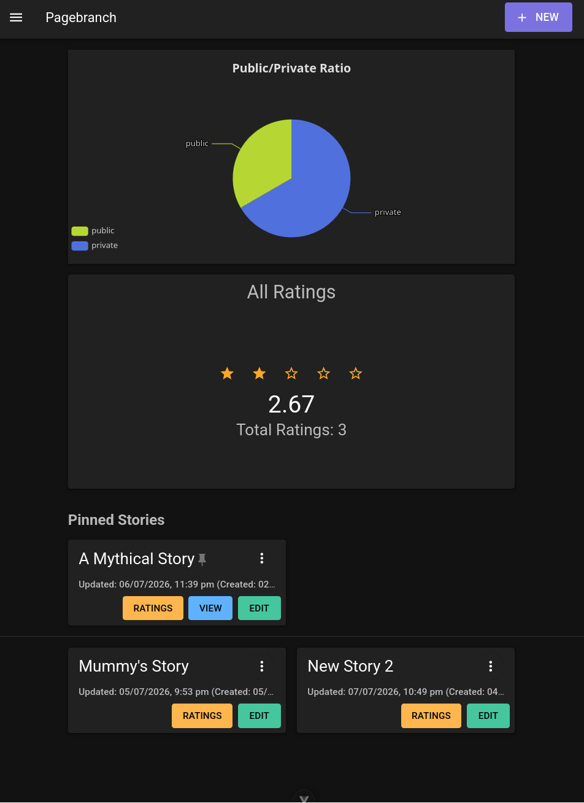
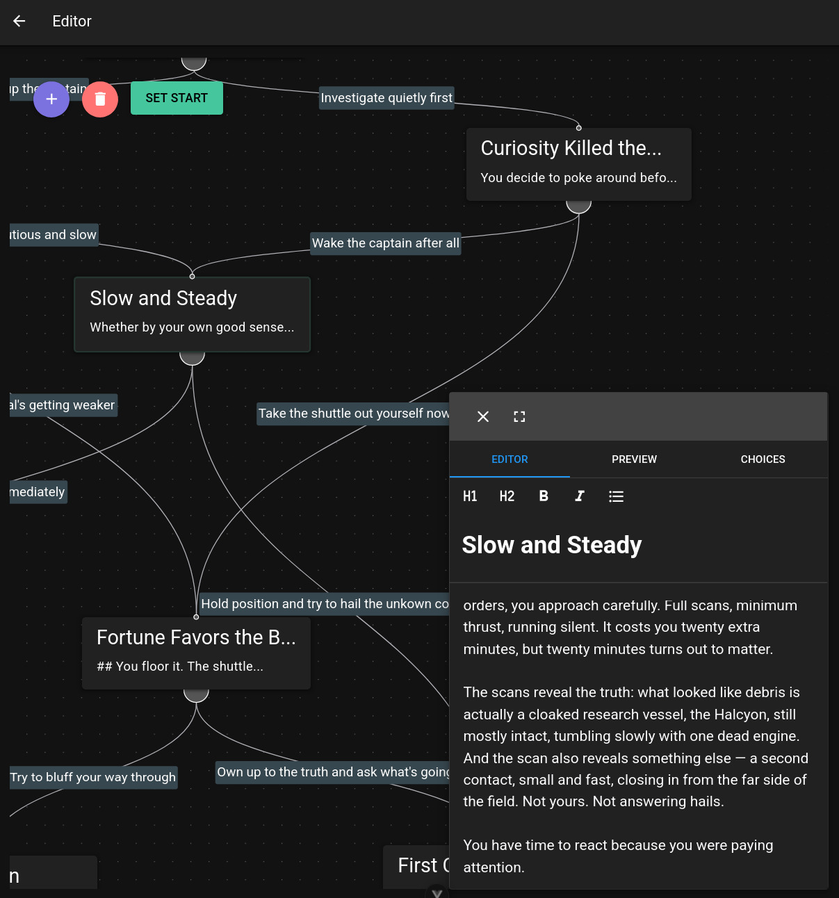
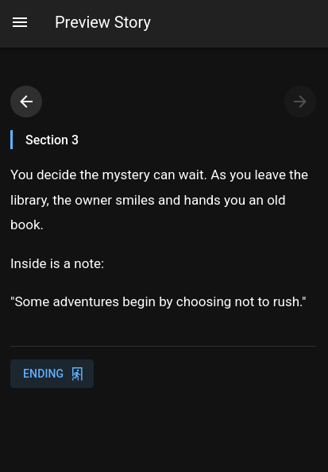
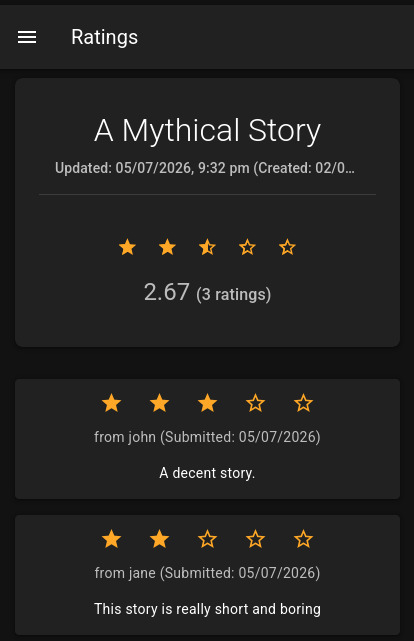

# Pagebranch

Build choose-your-own-adventure stories on a canvas. A Twine clone, but with excellent mobile support. Completely written without AI-assistance (excluding this README)

Instead of relying on a potentially unintuitive DSL, Pagebranch makes it easy with an interactive UI for creators who don't need power-user features — just an easy way to build basic branching stories and share them with friends.

> **Disclaimer:** This is a personal learning project, not a production-ready application. It hasn't been audited, load-tested, or hardened for real-world/public deployment, and it may not be actively maintained. Feel free fork it or use it as a reference, but use it at your own risk.




## Features

### Login & Register
- Standard username/password authentication
- **Security** — ownership is enforced at the database level, so users can never access or modify another user's data

### Homepage
- Chart for ratio of number of public stories to private stories, and your average rating across all your stories
- Add, modify, and delete stories
- Set ratings for stories
- View created and last-updated dates
- Configure sharing settings (make a story publicly viewable)
- Browse public ratings for other users' stories

### Settings
- Choose light, dark, or system theme
- Change the default spawn position for new passage nodes
- Change the default prepended text used when duplicating a passage
- Logout

### Editor
- View all passages and choices in a flowchart built with Vuetify and Vue Flow, styled with custom CSS components
- Add, update, and delete passage nodes
- Set a passage as the story's starting passage
- Connect choices between passages visually
- Update choice labels, reorder choices, and delete choices
- Full-featured markdown editor with live preview and convenient formatting buttons

### Story Page
- Anyone can view a story, but only the owner can edit it
- Read-only view for playing through published stories

## Tech Stack

- **Frontend:** Vue 3, Vuetify, Vue Flow, Vite
- **Backend:** Node.js, Express, Passport (session-based auth)
- **Database:** PostgreSQL

## Deployment

These are basic self-hosting instructions — there's no managed hosting or one-click deploy for this project. There is a demo available on [Railway](https://pagebranch-production.up.railway.app/home).

### Prerequisites

- Node.js (v20.19+ or v22.12+)
- PostgreSQL

### Setup

1. Clone the repository and install dependencies from the project root:

   ```bash
   git clone https://github.com/ashpertine/pagebranch.git
   cd pagebranch
   npm install
   ```

   `npm install` will also install the `client` and `server` dependencies and run the database migration script (`server/db/populate-db.js`) via `postinstall`.

2. Copy `.env.example` to `.env` in the project root and fill in your own values:

   ```bash
   cp .env.example .env
   ```

   | Variable         | Description                                  |
   | ---------------- | --------------------------------------------- |
   | `DB_HOST`        | PostgreSQL host                                |
   | `DB_NAME`        | PostgreSQL database name                       |
   | `DB_PORT`        | PostgreSQL port                                |
   | `DB_USER`        | PostgreSQL user                                |
   | `DB_PASS`        | PostgreSQL password                            |
   | `SESSION_SECRET` | Random secret used to sign session cookies     |
   | `APP_PORT`       | Port the Express server listens on             |
   | `NODE_ENV`       | `development` or `prod`                        |

   Make sure the database referenced in `DB_NAME` exists before running `npm install` (or re-run `npm run initDb` from `server/` afterward).

3. Build the client:

   ```bash
   npm run build
   ```

4. Start the server:

   ```bash
   npm start
   ```

   The app will be available at `http://localhost:<APP_PORT>`, serving both the API and the built client.

### Local Development

For hot-reloading during development, run the client and server separately in two terminals:

```bash
# Terminal 1 — API server (watches for changes)
cd server
npm run dev
```

```bash
# Terminal 2 — Vite dev server (proxies /api to the Express server)
cd client
npm run dev
```


### More screenshots


